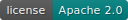

[](https://gitlab.phaidra.org/fair-data-austria-db-repository/fda-services/-/commits/master)
[](https://gitlab.phaidra.org/fair-data-austria-db-repository/fda-services/-/commits/master)
[](http://creativecommons.org/licenses/by/4.0/)

# FAIR Data Austria Database Repository

## Build

Everything is handled by compose, just build it by running:

```bash
docker-compose build
```
Local development minimum requirements:

- Ubuntu 18.04 LTS (RPM-based operating systems are also tested)
- Apache Maven 3.0.0
- OpenJDK 11.0.0

The backend endpoints are accessible in the browser:

- [Image Endpoint](http://localhost:9091/swagger-ui/)
- [Container Endpoint](http://localhost:9091/swagger-ui/)
- [Database Endpoint](http://localhost:9092/swagger-ui/)
- [Query Endpoint](http://localhost:9093/swagger-ui/)
- [Table Endpoint](http://localhost:9094/swagger-ui/)

The frontend is accessible in the browser:

- [FAIR Portal](http://localhost:3000)
- [Query Endpoint Management Portal](http://localhost:15672) (username=guest, password=guest)

Other:

- [Discovery Endpoint](http://localhost:9090/) (Eureka)
- [Gateway Endpoint](http://localhost:9095/swagger-ui/) (Webflux)

## Deployment

Local deployment minimum versions:

- Docker Engine 20.10.0
- Docker Compose 1.28.0

## Deployment

The pipeline is set-up to build and test all commits. A commit to dev or master branch triggers additional jobs.

Contributions are always welcome and encouraged, simply fork the repository and
contact [Andreas Rauber](http://www.ifs.tuwien.ac.at/~andi/).

# License

This work is licensed under
a [Creative Commons Attribution 4.0 International License](http://creativecommons.org/licenses/by/4.0/)